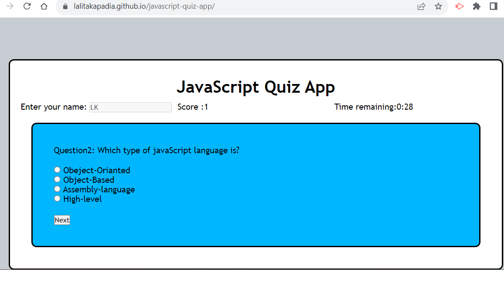

# javascript-quiz-app

## Description

I have developed this Javascript-quiz-app using HTML, CSS and Javascript as part of challenge given in the Birmingham University Bootcamp program.

It contains start button and username column.

In this app there are 7 easy questions and total 40 seconds to answer from multiple answer options.

All the quetions, options and answers stored in Data.js.

User can select next quetion and when all quetion answered then next button turn in  to submit.

If answer is correct then users score get update by 1.

If answer is wrong then users get penulty by minus 10 seconds from remaining time.

User can play game multiple time then app stores all the scores in local storage

When game finishes then user can see historic data for multiple play time.

##website
https://lalitakapadia.github.io/javascript-quiz-app/

